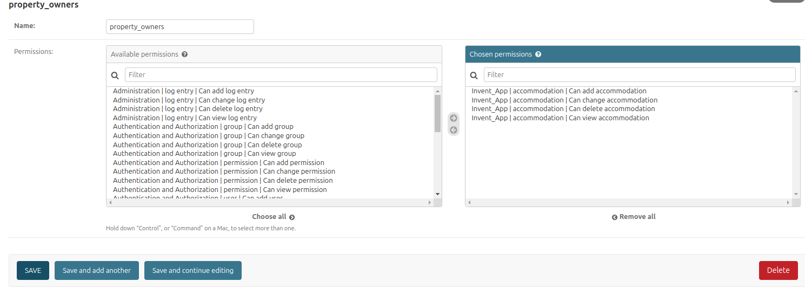
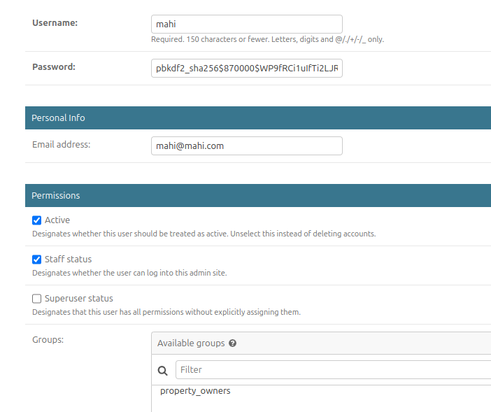
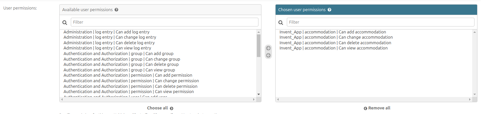
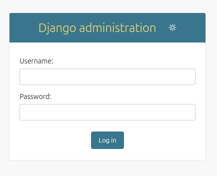

# Property Management System

This repository contains the **Property Management System**, a Django-based application designed to manage property information using geospatial data with PostgreSQL and PostGIS. The project includes a robust backend with an admin interface for managing properties, user permissions, and a public-facing sign-up page for property owners.

## Features

- **Geospatial Data Handling**: Utilizes PostGIS for location management.
- **Django Admin Interface**: User-friendly admin dashboard for property management.
- **Role-Based Access Control**: Permissions for property owners to manage their properties.
- **Localization Support**: Multilingual descriptions and policies for properties.
- **Sitemap Generator**: Command-line tool to generate a sitemap for all locations.
- **Public Sign-Up**: A dedicated page for property owner registration.

## Installation

### Prerequisites

Ensure the following software is installed:

- **Python 3+**
- **PostgreSQL** with the **PostGIS extension**
- **Docker**

### Steps

1. ### Clone the Repository ###

  ```bash
 git clone https://github.com/Mahi-markus/Inventory_Management.git

```

### Set Up a Virtual Environment

```bash
python -m venv .venv
.venv/Scripts/activate    #On windows
deactivate
```

```bash
python3 -m venv .venv
source .venv/bin/activate    #On linux
deactivate
```

### Run the Server

```bash
cd inventory_manage
docker compose up --build
```

```bash
docker compose up
```

### To stop

```bash
ctrl c

```

Install Dependencies(optional if Dependemcies do any unusual problem)

```bash
pip install -r requirements.txt
```


### Apply Migrations

```bash
docker exec -it inventory_manage-web-1 python manage.py makemigrations
```

```bash
docker exec -it inventory_manage-web-1 python manage.py migrate
```

### Create a Superuser

```bash

docker exec -it inventory_manage-web-1 python manage.py createsuperuser
```

then put Username,Email and Password in order to create a super user.

```bash
for example:
Username: admin
email: admin@admin.com
Password:admin
and then type y to avoid Bypass password validation

```

### Property owner group creation

1. login accessing http://localhost:8000/admin as admin
2. click groups and give a name for example: property_owners
3. In permissions segment: **select only the  accomodation related permissions and then save**.



## Create a normal user(property owner):

1.  Access the application at http://localhost:8000
2.  Fill all the necessary fields in order to create property owner user.
3.  Then Click on the signup and then go to login or
4.  Access the login page by this url: http://localhost:8000/admin and then login as normal user.

## Giving persimision(as a admin) to normal usr to their see their own property and update

1. login as admin.
2. click on a normal user and Acitve,Staff Status both.
3. In groups select the property owners group
4. In user permission select all accomodation related permissions and save.

  

 

## normal user

1. After getting permission by admin a normal user can see his own accomomation and update,delete also.
2. The normal user(property owner) need to login to do that

## property owner and admin both login page:


### Importing location data
1. Login as admin  
2. Go to location and click on the import
3. select the location.csv file given in the github
4. confirm the import

### Dummy Data example to for tables or models
1. **Dummy data for location:** 
```bash
    id=LOC002,
    title=New York City,
    center=select using the cursor pointer
    parent=select from drop down or can create,
    location_type=City,
    country_code=US,
    state_abbr=NY,
    city=New York
```


2. **Dummy data for accomodation:** 
```bash
    id=ACCOM001,
    feed=1,
    title=Modern Apartment in NYC,
    country_code=US,
    bedroom_count=2,
    review_score=4.5,
    usd_rate=150.00,
    center= select using the location pointer,  # Example location in NYC
    images=[
        "https://example.com/image1.jpg",
        "https://example.com/image2.jpg"
    ],
    location=location_nyc,
    amenities=["WiFi", "Air Conditioning", "Kitchen"],
    user_id=select from drop down or create, 
    published=True
```

3. **Dummy data for localize accommodation:**
```bash
    property= select property from drop down or create,
    language=en,
    description=A modern 2-bedroom apartment in the heart of New York City,
    policy={
        "check_in": "After 3 PM",
        "check_out": "Before 11 AM",
        "cancellation": "Free cancellation up to 48 hours before check-in."
    }
```       

### Sitemap generations instruction

```bash
cd inventory_manage
docker exec -it inventory_manage-web-1 python manage.py generate_sitemap
```


### Testing Instructions
```bash
cd inventory_manage
docker exec -it inventory_manage-web-1 python manage.py test
docker exec -it inventory_manage-web-1 coverage run manage.py test
docker exec -it inventory_manage-web-1  coverage report

```

